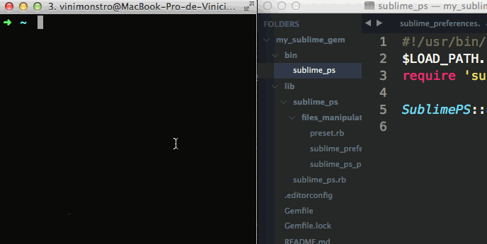

#Sublime PS 

[](http://badge.fury.io/rb/sublime_ps)

The sublime_ps is a rubygem that injects specific settings on SublimeText preferences file.



See this preferences files: [light.json](https://github.com/viniciusalmeida/dotfiles/blob/master/sublime_ps/light.json) and [dark.json](https://github.com/viniciusalmeida/dotfiles/blob/master/sublime_ps/dark.json).

## Usage

Install the ruby gem:

```bash
$ gem install sublime_ps
```

On `~/.sublime_ps` folder, create your preference JSON file based on SublimeText preferences file:

```json
{
  "color_scheme": "Packages/Color Scheme - Default/Monokai.tmTheme",
  "font_size": 24,
}
```

Use the name `presentation_livecoding.json` on this file.

So, run the command `$ sublime_ps a presentation_livecoding` and see the changes on SublimeText preferences.

### Config

If you see the error message `Sublime preferences file not find` on run sublime_ps. Change the `sublime_preferences_path` on file informed on error message with the correct path.
